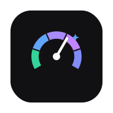
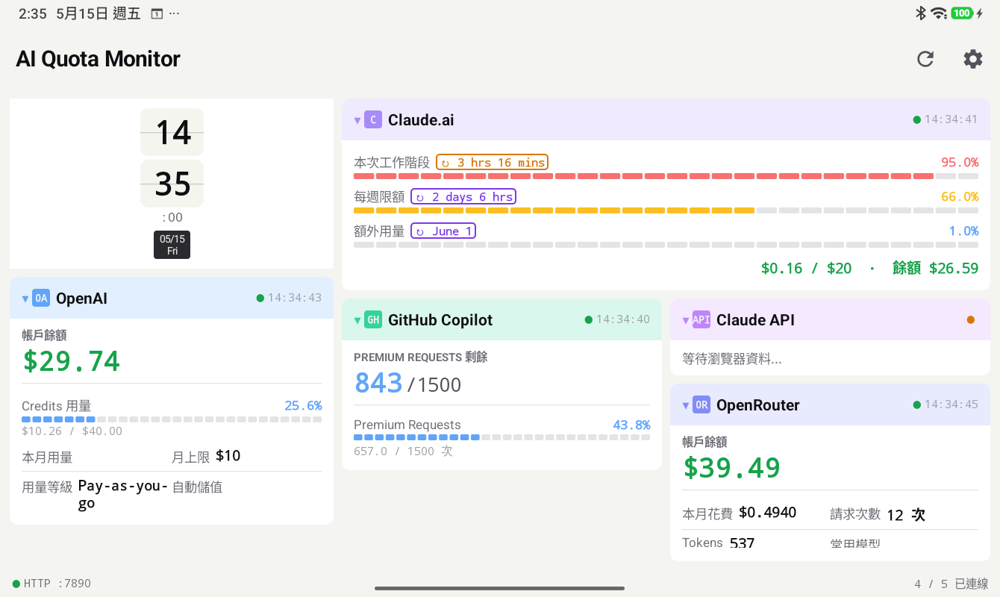
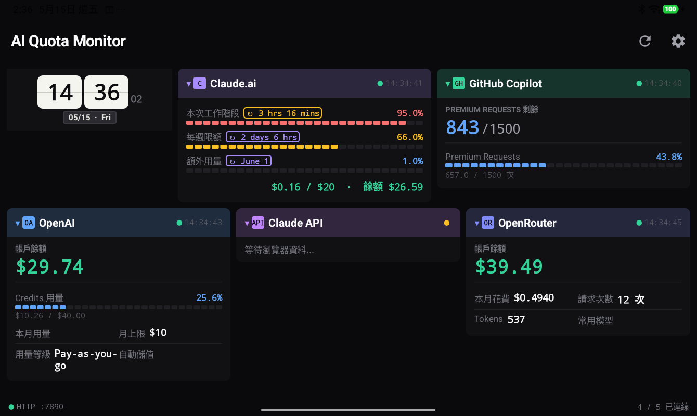
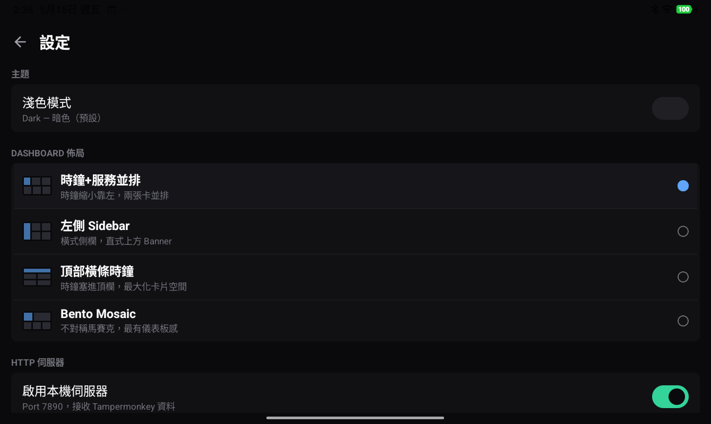
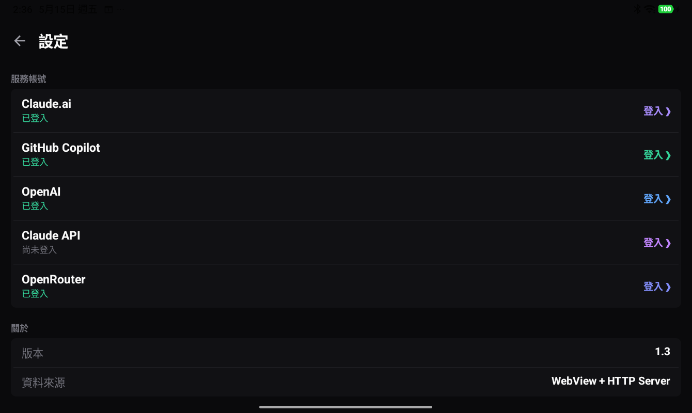
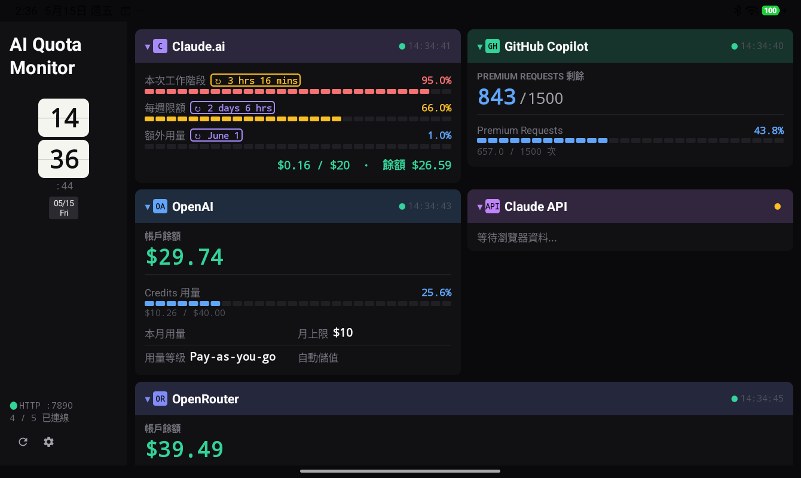
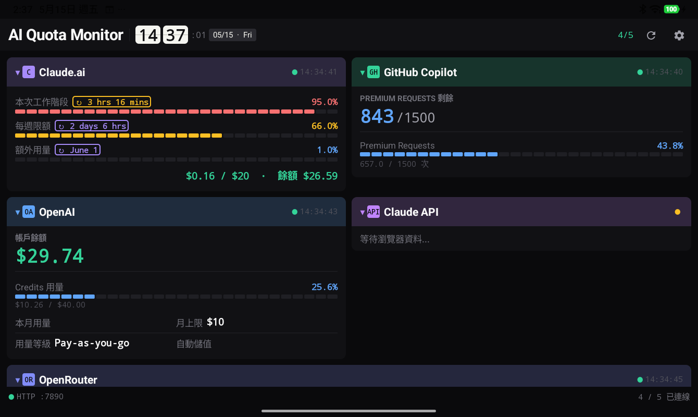
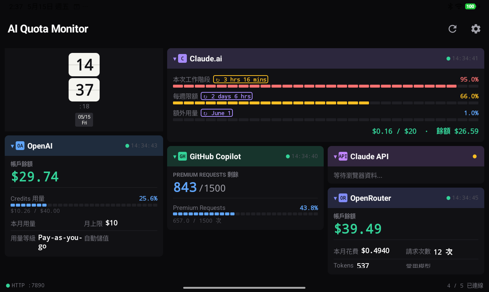

<p align="center">
  
</p>

<h1 align="center">AI Quota Monitor — Android</h1>

<p align="center">
  一鍵掌握所有 AI 服務餘額，隨時掌握用量不超支<br>
  Monitor your AI service quotas at a glance — ChatGPT, Claude, OpenAI, GitHub Copilot & OpenRouter
</p>

<p align="center">
  
  
  
  
</p>

---

## 📱 Screenshots

<table>
  <tr>
    <td></td>
    <td></td>
    <td></td>
    <td></td>
  </tr>
  <tr>
    <td align="center">儀表板總覽</td>
    <td align="center">服務用量卡片</td>
    <td align="center">進度條 / KV 列</td>
    <td align="center">卡片展開∕收合</td>
  </tr>
  <tr>
    <td></td>
    <td></td>
    <td></td>
    <td></td>
  </tr>
  <tr>
    <td align="center">設定頁</td>
    <td align="center">服務登入 (WebView)</td>
    <td align="center">翻頁時鐘卡片</td>
    <td></td>
  </tr>
</table>

---

## ✨ Features

| 功能 | 說明 |
|------|------|
| 🔍 **6 大 AI 服務監控** | ChatGPT、Claude.ai、GitHub Copilot、OpenAI、Claude API、OpenRouter |
| 🃏 **卡片式儀表板** | Home Assistant 風格，支援多欄佈局，可展開 / 收合，狀態持久化 |
| 🌐 **雙資料來源** | ① App 內 WebView + JS 注入（背景自動刷新）② PC 端 Tampermonkey 腳本推送 (port 7890) |
| 🕐 **翻頁時鐘** | 仿機械翻頁風格的即時時鐘卡片 |
| 🌑 **深色主題** | Linear / Raycast 風格深色配色，每個服務有專屬強調色 |
| 🍪 **Cookie 持久化** | 登入一次即可，重啟 App 免重新登入 |
| 🔔 **登入偵測** | 偵測 session 過期或 Google SSO 限制，即時提示重新登入 |
| ↕️ **依 Card 排序啟動** | 背景監控依設定中的 Card 順序啟動；停用 Card 不建立背景 WebView |

---

## 🚀 Quick Start

### 1. 安裝 APK

從 [Releases](../../releases) 下載最新 `ai-quota-monitor-vX.Y-release.apk`，安裝至 Android 12+ 手機。

### 2. 登入 AI 服務

進入 **設定 → 服務帳號**，依序對需要監控的服務點選「登入」，在內建 WebView 完成帳號登入後返回即可。

> **Claude API (platform.claude.com)** 使用 Google SSO 登入，Google 會封鎖 App 內 WebView。請改用頁面下方的 **Email 登入**，或使用 PC 端 Tampermonkey 腳本推送。

#### Claude.ai 使用教學

1. 在 **設定 → 服務帳號 → Claude.ai** 點選「登入」，於內建 WebView 完成登入。
2. App 會在背景開啟 `claude.ai/new#settings/usage`，擷取用量資料。
3. Claude.ai Card 依方案顯示多條進度條：
   - **本次工作階段** — 5 小時滾動額度與重設倒數
   - **每週限額（全部模型）** — 每週全模型合計用量
   - **Fable 週限額** — 若方案含單一模型（例如 Fable）的獨立週額度，會額外顯示該模型用量；標籤取自 API 回傳的模型名稱，未來換模型可自動跟進
   - **額外用量** — 若已開啟 usage credits，顯示已花費 / 上限與餘額

> 進度條會依帳號方案而異；沒有單一模型週限額的帳號不會顯示 Fable 進度條。

#### ChatGPT 使用教學

1. 在 **設定 → 服務帳號 → ChatGPT** 點選「登入」。
2. 於內建 WebView 完成 ChatGPT 登入，確認已進入 ChatGPT 後按右上角勾勾完成。
3. App 會在背景開啟 `chatgpt.com/#settings/Usage`，擷取每週剩餘額度與重設時間。
4. 返回儀表板即可查看 ChatGPT Card；若方案提供點數資訊，Card 也會一併顯示。

> ChatGPT Usage 頁面及欄位會依帳號方案而異；沒有 Usage 權限的帳號可能不會產生額度資料。

### 3. 查看儀表板

返回主畫面，系統會自動在背景載入各服務頁面並更新用量資訊。

### （選用）PC 端 Tampermonkey 推送

若偏好從電腦瀏覽器取得資料，可在電腦安裝 [Tampermonkey](https://www.tampermonkey.net/) 並載入 `scripts/ai-monitor-client-v4.4.js`，將資料推送至手機 `IP:7890`。

---

## 🏗️ Architecture

```
資料來源                            記憶體儲存                   UI 層
┌─────────────────────┐
│  WebView + JS 注入   │──┐
│  （背景自動刷新）      │  │    ┌──────────────────────┐   ┌─────────────────┐
└─────────────────────┘  ├──▶ │  DataStoreRepository  │──▶│  DashboardScreen │
┌─────────────────────┐  │    │  （StateFlow / 記憶體）  │   │  ServiceCard     │
│  HTTP Server :7890   │──┘    └──────────────────────┘   │  ClockCard       │
│  （Tampermonkey）    │                                    └─────────────────┘
└─────────────────────┘
```

---

## 📋 Monitored Services

| Service | Source Key | 資料來源頁面 |
|---------|-----------|------------|
| Claude.ai | `claude_usage` | claude.ai/new#settings/usage |
| GitHub Copilot | `github_copilot` | github.com/settings/copilot/features + /settings/billing/budgets |
| OpenAI | `openai_billing` | platform.openai.com/billing |
| Claude API | `claude_billing` | platform.claude.com/settings/billing |
| OpenRouter | `openrouter` | openrouter.ai/settings/credits + /activity |
| ChatGPT | `chatgpt_usage` | chatgpt.com/#settings/Usage |

---

## 🔨 Build from Source

```bash
# Debug APK
./gradlew assembleDebug

# Release APK
./gradlew assembleRelease

# Unit tests (JVM, no device needed)
./gradlew test
```

> Windows：請使用 `gradlew.bat` 取代 `./gradlew`

### Requirements

- Android Studio Meerkat (2024.3) 或更新版本
- JDK 17+
- Android 12+ 裝置或模擬器 (minSdk 31)

---

## 🛠️ Tech Stack

- **Kotlin 2.2.10** + **Jetpack Compose** (BOM 2026.02.01) + **Material3**
- **NanoHTTPD** — 嵌入式 HTTP Server
- **kotlinx.serialization** — 設定檔 JSON 序列化
- **AndroidX Navigation Compose** — 頁面導航
- AGP 9.1.1 | targetSdk 36 | minSdk 31

---

## 🤝 Credits

Android port of [ai-quota-monitor](https://github.com/bjoe0201/ai-quota-monitor) by [@bjoe0201](https://github.com/bjoe0201).  
Original desktop app: Python + tkinter.

---

## 📄 License

[MIT](LICENSE)
